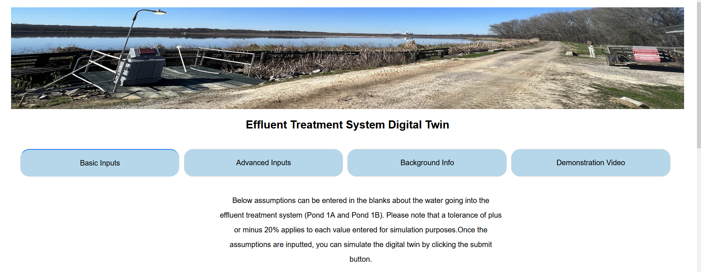
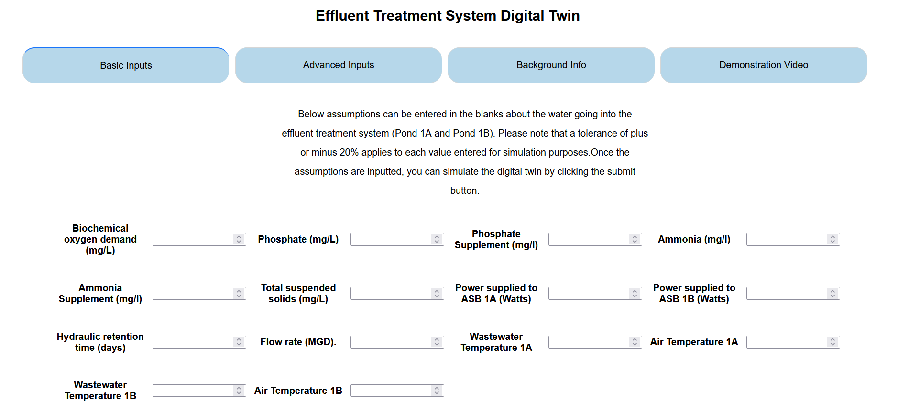
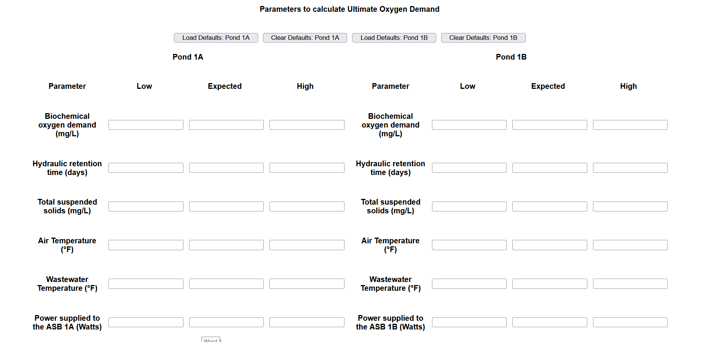
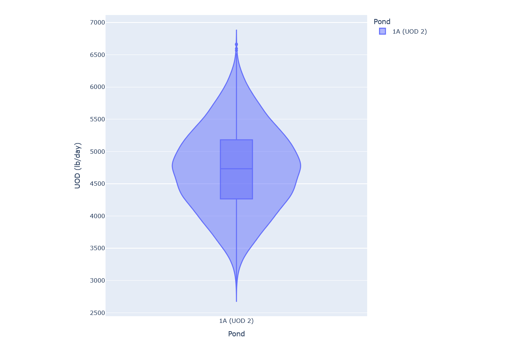
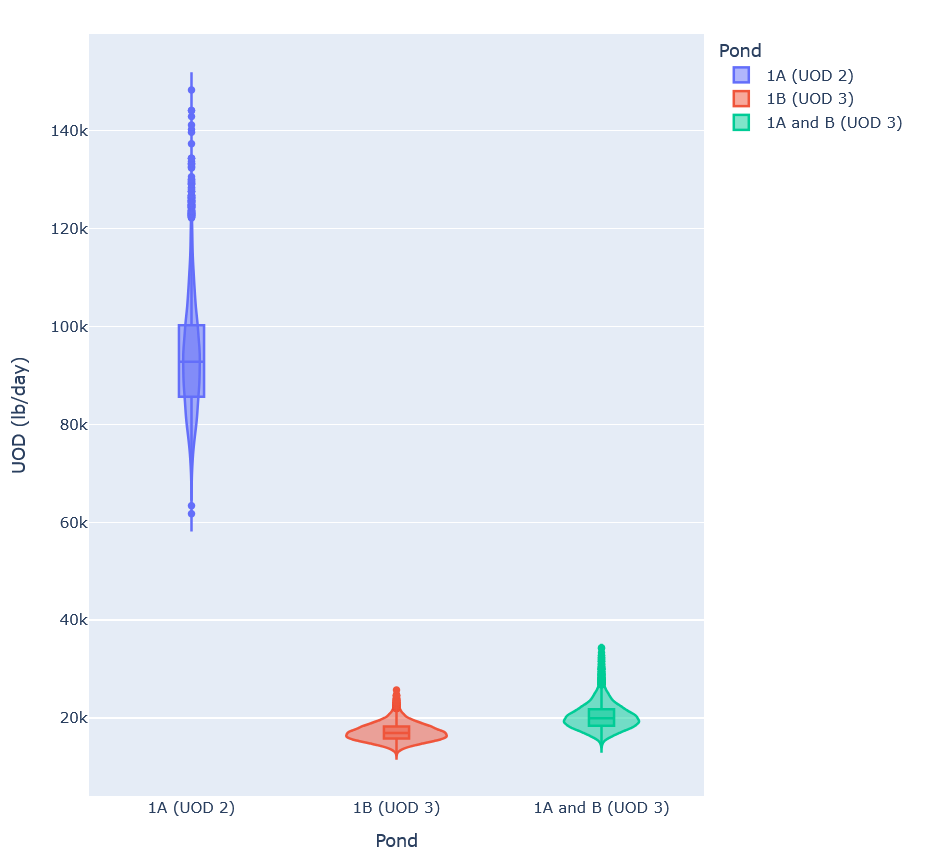

# Digital Twin of Paper Mill Waste Water Treatment Process
This project is the result of work I did during an internship in college. Collaborating with an Environmental Engineering professor, I developed a website that simulates the wastewater treatment process of a paper mill in Augusta, Georgia. The goal was to create a tool that allows the paper mill to model and adjust its wastewater treatment process without impacting actual operations.

## My Contributions
When I started my intership the professor alread had Python scripts to simulate the waste water treatment process of the paper mill but Python scripts are not very use friendly especially for non-programmers. What I did during my intership was create a website front-end that users could use to provide inputs to the Python scripts that simulated the paper mill's waste water treatment process. Completing this also required integrating the font-end I created with the Python scripts in the backend. 

## Project Architecture

Fontend: Writing using HTML, CSS, Python using the Dash framework: https://dash.plotly.com/ \
Backend: Python

## Screenshots

### Home Page

### Basic Page
#### This page is for running a basic simulation with only a limited number of inputs. 

#### Example Output Graph

### Advanced Page
#### This page is for running simulations with many different inputs. It also allows for up to 3 simulations to be run at the same time with all the results shown on one graph.

##### Output Graph

#### Multiple Simulations Graph

