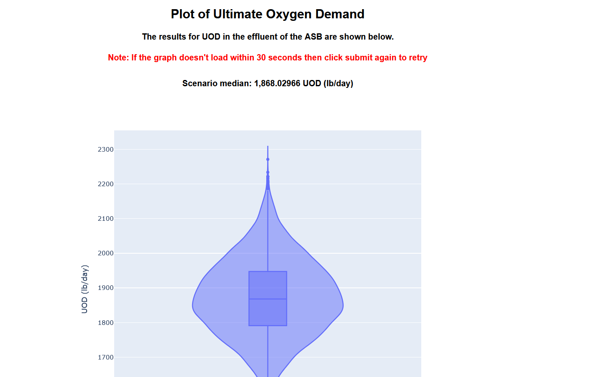

# Digital Twin of Waste water Treatment Process
This project is the result of work I did for an intership while in collge. Working with an Enviromental Engineering professor I developed a website that runs simulations of the waster water treatment process of a paper mill operating out of Agusta Georgia. The goal of this project was to create tool that the paper mill could use to simulate their waste water treatment process and make changes without affecting the actual paper mill.

## My Contributions
When I started my intership the professor alread had Python scripts to simulate the waste water treatment process of the paper mill but Python scripts are not very use friendly especially for non-programmers. What I did during my intership was create a website front-end that users could use to provide inputs to the Python scripts that simulated the paper mill's waste water treatment process. Completing this also required integrating the font-end I created with the Python scripts in the backend. 

## Project Architecture

Fontend: Writing using HTML, CSS, Python using the Dash framework: https://dash.plotly.com/ \
Backend: Python

## Screenshots

### Home Page

### Basic Page
This page is for running a basic simulation with only a limited number of inputs.

Graph

